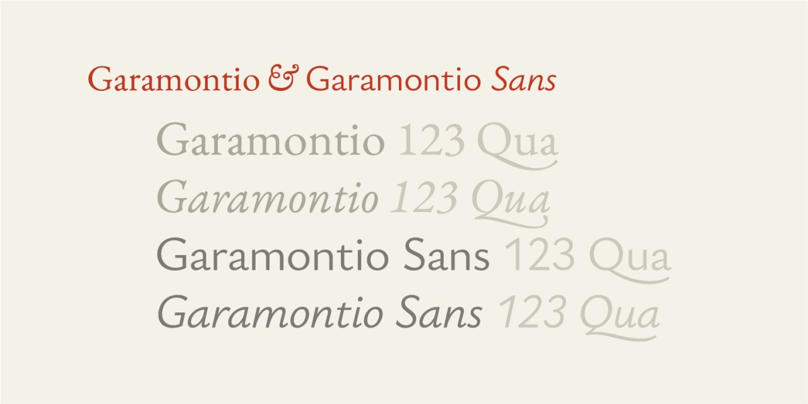
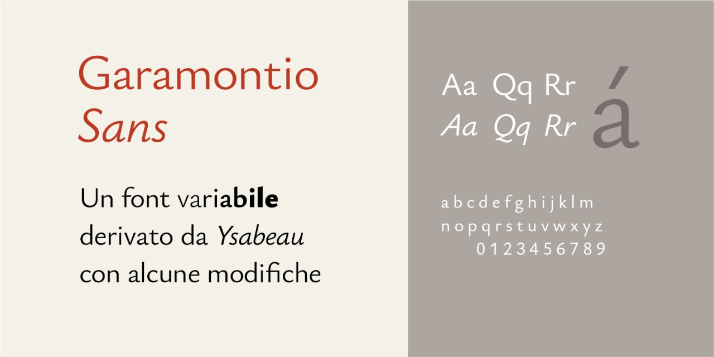
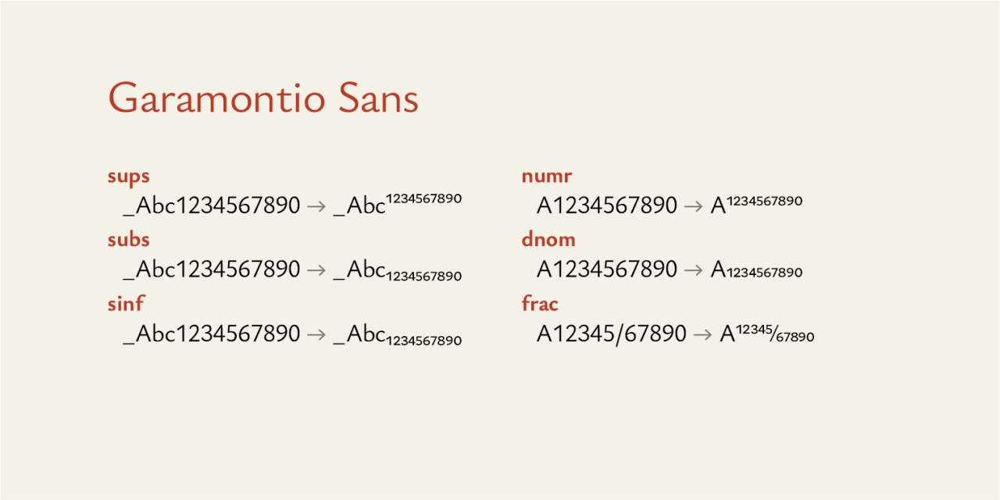
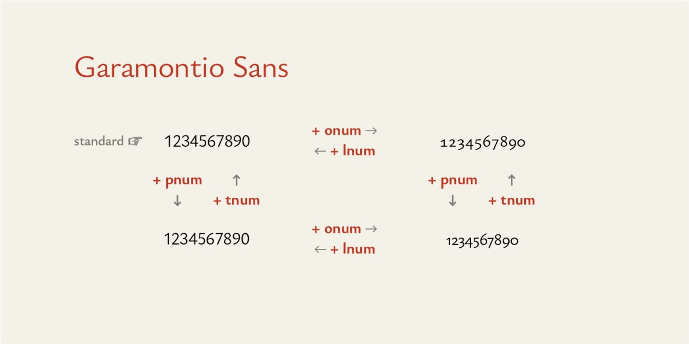

# Garamontio Sans
- Versione 0.911: fix minori e creazione file per versioni statiche del font (otf, ttf, woff, woff2)
- Versione 0.906: tentativo di migliorare compatibilità con _[Garamontio](https://github.com/m-casanova/Garamontio)_
- Versione 0.902: fix frazioni
- Versione 0.901: versione di prova con alcune variazioni rispetto a [Ysabeau](https://github.com/CatharsisFonts/Ysabeau)

Per maggiori informazioni e per testare il font, vedere la [pagina interattiva](https://m-casanova.github.io/GaramontioSans/).

## Utilizzo
Il font è distribuito in formato WOFF2 e TTF; è rilasciato con licenza OFL 1.1.

## Descrizione
_Garamontio Sans_ è derivato da _[Ysabeau](https://github.com/CatharsisFonts/Ysabeau)_ sviluppato da Christian Thalmann.

Alcuni elementi sono stati modificati per cercare di migliorare compatibilità con _[Garamontio](https://github.com/m-casanova/Garamontio)_.

Esempi di alcune caratteristiche opentype:

